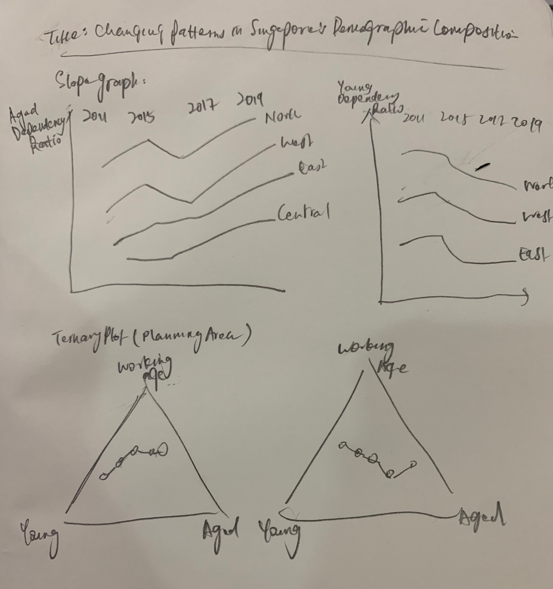

```{r setup, include=FALSE}
knitr::opts_chunk$set(echo = TRUE)
```

# 1.0 Introduction
Ever wondered which region of Singapore is more popular with the working population, Or where there is a higher concentration of aged population, and how has this age demographics concentration changed over time? This makeover exercise aims to reveal the changing patterns of demographic composition in Singapore by geographical hierarchy over time. The visualisation explores several dimensions, including:

- Population of 3 broad age groups: The Young (age 0-24yrs), Working-age (25-64yrs) and Aged (above 65years)
- Planning Area and Region
- Time period of 2011-2019, in years


***

# 2.0 Data & Design
## 2.1 Challenges
1. The dataset contains administrative boundaries demarcated by the Urban Authority of Singapore, such as Planning Area and Subzone. However, the high level demarcation of region (i.e. North, North-east, East, West, Central) is not found in this dataset. The challenge is therefore in obtaining the data on which planning areas are organised under which regions, and then mapping this information onto the dataset.

2. The visualisation aims to reveal changing patterns in age compositions across geographical demarcations and hierarchies. As there are many planning areas in Singapore, the challenge is then in being able to produce a clean graph that is able to clearly show trends of age compositions of each region/planning area and at the same time effectively compare the trends of one region/planning area with that of others. 

3. To simultaneously visualise 3 measures, namely the population proportion of the Young, Working Age and Aged broad age categories. On top of which, the requirement for this exercise is to use static plots to create the visualisation, which restricts revealing details or dimensions through animation or interactivity.

## 2.2 Ways to Overcome Challenges
1. This census division information data can be found on  Wikipedia page. Link:https://en.wikipedia.org/wiki/Planning_Areas_of_Singapore
The table listing the regions and its corresponding planning areas can be scraped using **Rvest** package.

2. The use slope graph can help to put focus on the changes in dependency ratios across sequential points in time, as visually encoded by the gradient of the slopes. It is not concerned with the variations in between the selected time intervals, hence helps to reduce the complexity of the visualisation. At the same time, slope graphs can effectively show how each region's rate of change compares with other regions. The vertical order of the regions also reveal the ranking of regions in terms of dependency ratios at each point in time.

3. Ternary bubble plot can be used to simultaneously visualise the 3 ratios using uses a barycentric coordinate system. To show changes across time, trellis of ternary graphs (aka faceting) can be created. Alternatively, a ternary plot that connects the data points in sequential years can be created.


## 2.3 Sketch of Proposed Design

```{r, out.width = "400px", fig.align='center', echo=FALSE}

```

***

# 3.0 Step-by-step Data Visualisation Preparation
## 3.1 Installing and launching R packages

A list of packages, namely **tidyverse**, **rvest**, **ggtern**, **CGPfunctions**, **ggpubr**, **viridis** are required for this makeover exercise. This code chunk installs the required packages and loads them onto RStudio environment.

```{r message=FALSE, warning=FALSE}
packages <- c('tidyverse','rvest','reshape2','ggtern','viridis','ggrepel','CGPfunctions','ggpubr')

for (p in packages){
  if (!require(p,character.only=T)){
    install.packages(p)
  }
  library(p, character.only=T)
}
```

## 3.2 Data Preparation

### Data Source 
The dataset used in this exercise is **Singapore Residents by Planning AreaSubzone, Age Group, Sex and Type of Dwelling, June 2011-2019.csv**, published by the Singapore Department of Statistics and was downloaded from the website  https://www.singstat.gov.sg/find-data/search-by-theme/population/geographic-distribution/latest-data.

### Importing the dataset 
Data import was accomplished using `read_csv()` of **readr** package, which is useful for reading delimited files into a `tibble`.
```{r message=FALSE, warning=FALSE, results='hold'}
# Reading the csv file as a tbl_df
pop_data <- read_csv("Data/respopagesextod2011to2019.csv")
# Inspecting the structure of the dataset
str(pop_data)
```

The columns were renamed more intuitively from ‘PA’, ‘SZ’, ‘AG’, ‘Pop’, and ‘Time’ to ‘Planning Area’, ‘Subzone’, ‘Age Group’, ‘Population’ and ‘Year’, respectively.
```{r message=FALSE, warning=FALSE}
pop_data <- pop_data %>%
  rename('Planning_Area'='PA',
         'Subzone'='SZ',
         'Age_Group'='AG',
         'Population'='Pop',
         'Year'='Time')

# verify if the columns have been renamed correctly
colnames(pop_data)
```


### Scraping Planning Region Data from Wikipedia
The dataset contains administrative boundaries demarcated by the Urban Authority of Singapore, such as Planning Area and Subzone. However, the high level demarcation of region (i.e. North, North-east, East, West, Central) is not found in this dataset, hence, will be supplemented through web scraping from external sources. **Rvest** package is used for the purpose of web scraping.
```{r message=FALSE, warning=FALSE}

#Specifying the url for website to be scraped
url <- 'https://en.wikipedia.org/wiki/Planning_Areas_of_Singapore'

#Scraping HTML table
planning_region <- url %>%
  read_html() %>%
  html_nodes(xpath='//*[@id="mw-content-text"]/div/table[3]') %>%
  html_table(fill=TRUE)

planning_region <- planning_region[[1]]

head(planning_region)

# dplyr for data wrangling 
# renaming and selecting required columns
# write to csv
planning_region_final <- planning_region %>%
  tbl_df() %>%
  rename('Planning_Area'='Name (English)') %>%
  select(c('Planning_Area','Region')) 

head(planning_region_final)

```


### Data Wrangling
The two datasets will be combined using a `left_join()` from the **dplyr** package.
```{r message=FALSE, warning=FALSE}
pop_data_final <- left_join(pop_data, planning_region_final, by="Planning_Area")

head(pop_data_final)
```


TOD (Type of Dwelling) will not be used in the visualisation, therefore it is necessary to aggregate the population measure excluding TOD level of detail. This can be achieved by using `group_by` and `summarise` functions from the **dplyr** package to sum up population by Year, Region, Planning_Area and Age_Group.
```{r message=FALSE, warning=FALSE}
agg_pop <- pop_data_final %>% 
  select(c("Year","Region","Planning_Area","Age_Group","Population")) %>%
  group_by(Year,Region,Planning_Area,Age_Group) %>% 
  summarise(Population=sum(Population))
head(agg_pop)
```

The absence of missing data is verified to ascertain that the data preparation thus far has been done correctly.
```{r message=FALSE, warning=FALSE}
apply(agg_pop, 2, function(x) any(is.na(x)))
```


## 3.3 Feature Engineering

The exhaustive list of age group categories is printed for verification.
```{r message=FALSE, warning=FALSE}
agg_pop$Age_Group <- as.factor(agg_pop$Age_Group)
levels(agg_pop$Age_Group)
```

Categorizing Age Group
```{r message=FALSE, warning=FALSE}
Young <- c("0_to_4","5_to_9","10_to_14","15_to_19","20_to_24")
Working_age <- c("25_to_29","30_to_34","35_to_39","40_to_44","45_to_49","50_to_54","55_to_59","60_to_64")
Aged <- c("65_to_69","70_to_74","75_to_79","80_to_84","85_to_89", "90_and_over")


agg_pop_ag <- agg_pop %>%
  mutate(AgeGroup = case_when(
    Age_Group %in% Young ~ "Young",
    Age_Group %in% Working_age ~ "Working_Age",
    Age_Group %in% Aged ~ "Aged")) %>%
  select(-Age_Group)

head(agg_pop_ag)
```


Deriving Young, Working Age and Aged population measures using `spread()` from **tidyr** package. By defining the AgeGroup as the key and the Population as the value, the function spreads the key-value pair across multiple columns. 

Take note that an index column that uniquely identify each observation must be introduced here, to prevent `spread()` from collapsing observations with same values into a single row. 

```{r message=FALSE, warning=FALSE}
spread_pop_intermediate <- agg_pop_ag %>%
  mutate(i = row_number()) %>%
  spread(AgeGroup, Population) %>%
  select(-i)
head(spread_pop_intermediate)
```

The resulting dataframe contains alot of NA values, due to the introduction of the index column prior to `spread()`. To resolve this, the NA values are first replaced with 0, and then `group_by` and `summarise()` are used sum up the observations for Aged, Working_Age and Young columns for a given year, region and planning area.
```{r message=FALSE, warning=FALSE}
spread_pop_intermediate[is.na(spread_pop_intermediate)] <- 0
spread_pop_ag <-spread_pop_intermediate %>%
  group_by(Year,Region,Planning_Area) %>% 
  summarise(Aged=sum(Aged),Working_Age=sum(Working_Age),Young=sum(Young)) %>% 
  mutate(Population= Aged + Working_Age + Young)
head(spread_pop_ag)
```

Further data manipulations will be performed using spread_pop_ag as the base dataframe, as and when required to create the subsequent data visualisations.

## 3.4 Slope Graph
Slope graphs are used to visualise the dependency ratios over a time period 2011-2019. The definition and formula of the dependency ratios are given below:

* **Young Dependency Ratio**
+ Definition: ratio of population age 0-15 years to the population age 16-64 years
+ Formula: $\frac {Young}{Working_Age}$


* **Aged Dependency Ratio**
+ Definition: ratio of population age 65 years and above to the population age 16-64 years
+ Formula: $\frac {Aged}{Working_Age}$

Slope graph, as opposed to line graph, is useful to emphasise on the changes in dependency ratios across sequential points in time, as visually encoded by the gradient of the slopes, and at the same time highlights how each region's rate of change compares with other regions. The vertical order of the regions also reveal the ranking of regions in terms of dependency ratios at each point in time.

In order to compare the age composition and dependency ratios across Regions, further aggregation of observations grouped by Region have to be done before deriving the dependency ratios. This is accomplished with the below code chunk.
```{r message=FALSE, warning=FALSE}

spread_pop_region <- spread_pop_ag %>%
  select(c("Year","Region","Aged","Working_Age","Young","Population")) %>%
  group_by(Year, Region) %>% 
  summarise(Aged=sum(Aged),Working_Age=sum(Working_Age),Young=sum(Young),Population=sum(Population)) %>%
  mutate(Aged_Dependency_Ratio= Aged/Working_Age) %>%
  mutate(Young_Dependency_Ratio= Young/Working_Age) %>%
  mutate(Aged_Dependency_Ratio = round(Aged_Dependency_Ratio*100, digits=1),
         Young_Dependency_Ratio = round(Young_Dependency_Ratio*100, digits=1)) %>%
  ungroup(Year) %>%
  mutate(Year = factor(Year)) %>%
  filter(Year %in% c(2011, 2013, 2015, 2017, 2019))

head(spread_pop_region)

```

The slope graphs for Aged Dependency Ratio and Young Dependency Ratio are created using `newggslopgraph()` from the **CGPfunctions** package.
```{r message=FALSE, warning=FALSE, fig.align='center', fig.show='hold', fig.height = 5, fig.width = 8}


adr<- newggslopegraph(dataframe=spread_pop_region, 
                      Times=Year, 
                      Measurement=Aged_Dependency_Ratio, 
                      Grouping =Region,
                 XTextSize = 10, YTextSize = 3, WiderLabels=TRUE) +
  labs(title="Aged Dependency Ratio by Region",
       subtitle= NULL,
       caption="Key Observations:
       #1 Central region is the highest ranked and also has
       the biggest increase in Aged Dependency Ratio 
       from 2011 to 2019.
       #2 East region has lower Aged Dependency Ratio than 
       North-east region in 2011, but has overtaken the latter 
       in 2019. ")+
  theme(plot.caption = element_text(hjust = 0.5,size = 10))
ydr <- newggslopegraph(spread_pop_region, Year, Young_Dependency_Ratio, Region,
                       XTextSize = 10, YTextSize = 3, WiderLabels=TRUE) +
  labs(title="Young Dependency Ratio by Region",
        subtitle= NULL,
       caption="Key Observations: 
       #1 Although North region is ranked the highest in terms of
       Young Dependency Ratio, East region has the biggest drop in 
       Young Dependency Ratio from 2011 to 2019.
       #2 While the Young Dependency Ratio is on a decreasing trend 
       across Singapore, North-East Region in particular has the 
       smallest drop in Young Dependency Ratio.")+
  theme(plot.caption = element_text(hjust = 0.5,size = 10))

grid.arrange(adr, ydr, ncol = 2)
```

In subsequent sections, deeper analysis is focused on regions with the steepest change in dependency ratios, i.e. Central region for aged dependency ratio and East region for Young Dependency Ratio. 

Horizontal bar plots were plotted to quickly verify which planning areas have a sizeable population, and therefore have more impact in causing larger shifts in overall age compositions in each region.
```{r message=FALSE, warning=FALSE, fig.align='center', fig.show='hold'}

spread_pop_C <- spread_pop_ag %>% 
  filter(Year == "2019",
         Region %in% c("Central"),
         Population > 0)
spread_pop_C$Planning_Area <- factor(spread_pop_C$Planning_Area) %>%
  fct_reorder(spread_pop_C$Population)


spread_pop_E <- spread_pop_ag %>% 
  filter(Year == "2019",
         Region == "East",
         Population > 0) 
spread_pop_E$Planning_Area <- factor(spread_pop_E$Planning_Area) %>%
  fct_reorder(spread_pop_E$Population)
  
bar_C <- ggplot(spread_pop_C, aes(x= Planning_Area, y= Population)) +
         geom_col() +
         coord_flip() 

bar_E <- ggplot(spread_pop_E, aes(x= Planning_Area, y= Population)) +
         geom_col() +
         coord_flip() 

grid.arrange(bar_C, bar_E, ncol = 2)

```


The change in of dependency ratios between 2011 and 2019 for each planning area in the Central and East regions are plotted below. Note that only the top 10 planning areas by population size in the East has been included in the analysis.
```{r message=FALSE, warning=FALSE, fig.align='center', fig.show='hold', fig.height = 6, fig.width = 8, echo=FALSE}
# Deriving the dependency ratios by Planning Area
spread_pop_pa <- spread_pop_ag %>%
  mutate(Aged_Dependency_Ratio= Aged/Working_Age) %>%
  mutate(Young_Dependency_Ratio= Young/Working_Age)

c_dr <- spread_pop_pa %>% 
  filter(Region %in% c("Central"),
         Year %in% c(2011, 2019),
         Planning_Area %in% c("Bukit Merah", "Toa Payoh","Geylang","Kallang","Queenstown","Bishan","Bukit Timah","Novena","Marine Parade","Tanglin")) %>%
  ungroup(Year) %>% 
  mutate(Year=factor(Year),
         Aged_Dependency_Ratio = round(Aged_Dependency_Ratio*100, digits=1),
         Young_Dependency_Ratio = round(Young_Dependency_Ratio*100, digits=1))
e_dr <- spread_pop_pa %>% 
  filter(Region %in% c("East"),
         Year %in% c(2011, 2019),
         Population > 0) %>%
  ungroup(Year) %>% 
  mutate(Year=factor(Year),
         Aged_Dependency_Ratio = round(Aged_Dependency_Ratio*100, digits=1),
         Young_Dependency_Ratio = round(Young_Dependency_Ratio*100, digits=1))

c_dr <- newggslopegraph(c_dr, Year, Aged_Dependency_Ratio, Planning_Area,
                TitleTextSize = 11,XTextSize = 10, YTextSize = 3, WiderLabels=TRUE) +
  labs(title="Aged Dependency Ratio",
        subtitle= "Central Region",
       caption="Bukit Merah has the steepest increase in 
       Aged Dependency Ratio between 2011 and 2019")+
  theme(plot.caption = element_text(hjust = 0.5,size = 10))

e_dr <- newggslopegraph(e_dr, Year, Young_Dependency_Ratio, Planning_Area,
                TitleTextSize = 11, XTextSize = 10, YTextSize = 3, WiderLabels=TRUE) +
  labs(title="Young Dependency Ratio",
        subtitle= "East Region",
       caption="Pasir Ris has the steepest drop in 
       Young Dependency Ratio between 2011 and 2019")+
  theme(plot.caption = element_text(hjust = 0.5,size = 10))

grid.arrange(c_dr, e_dr, ncol = 2)
```


## 3.4 Creating a Static Ternary Plot

Ternary plots are useful to simultaneously visualise three measures, specifically the ternary composition of the three broad age groups, the young, working age and aged.
To build static ternary plots, the **ggtern** package can be used. For a start, the age composition of planning areas across Singapore in the year 2019 is visualised.
Additional aesthetics are mapped to encode several dimensions onto the same graph:
- `fill = Region` - to color code the data points by Region
- `size = Population` - to vary the size of the data points by population size

```{r fig.align = "center", message=FALSE, warning=FALSE }

tern_2019 <- spread_pop_ag %>%
  filter(Year==2019) %>%
  ggtern(aes(x=Young,y=Working_Age, z=Aged, fill= Region, size=Population)) +
  geom_point(alpha=0.7,shape=21, color="white") +
  guides(size = FALSE) +
  theme_bw() + 
  ggtitle("Age Composition Across Planning Areas, 2019")

tern_2019 
```


The datapoints representing the age composition of different planning areas are mostly clustered together around the same region on the ternary graph, therefore difficult to interpret. The graph can be improved by adjusting the ternary scales. This is achieved by passing a vector specifying the limits into the functions `scale_T_continuous`, `scale_L_continuous` and `scale_R_continuous`.

Additional touch-up has been made by adding arrows, arrow labels and vertex labels.
```{r fig.align = "center", message=FALSE, warning=FALSE, echo=FALSE }

tern_2019 +
  scale_T_continuous(limits=c(0.4,0.9)) + 
  scale_L_continuous(limits=c(0.1,0.6)) +
  scale_R_continuous(limits=c(0,0.5))+
  theme_showarrows() +
  labs( x       = "Young",
      xarrow  = "% age 0-14years",
      y       = "Working Age",
      yarrow  = "% age 15-64years",
      z       = "Aged",
      zarrow  = "% 65+ years") + 
  theme(legend.position = "bottom",
          legend.box = "horizontal",
        tern.axis.title.T = element_text(),
          tern.axis.title.L = element_text(hjust = 0.2, vjust = 0.7, angle = -60),
          tern.axis.title.R = element_text(hjust = 0.8, vjust = 0.6, angle = 60))
  
```


To visualise the age compositions across time, trellis of ternary graphs (aka faceting) can be created. This is simply done by adding `facet_wrap(. ~ Year)`.

```{r fig.height = 12, fig.width = 12, fig.align = "center", message=FALSE, warning=FALSE, echo=FALSE }

tern_all <- ggtern(data=spread_pop_ag, aes(x=Young,y=Working_Age, z=Aged, fill= Region, size=Population)) +
  geom_point(alpha=0.7, shape=21, color="white") +
  guides(size = FALSE) +
  facet_wrap(. ~ Year) 

tern_all +
  theme_bw() +
  scale_T_continuous(limits=c(0.4,0.9)) + 
  scale_L_continuous(limits=c(0.1,0.6)) +
  scale_R_continuous(limits=c(0,0.5))+
  theme_showarrows() +
  labs( x       = "Young",
      xarrow  = "% age 0-14years",
      y       = "Working Age",
      yarrow  = "% age 15-64years",
      z       = "Aged",
      zarrow  = "% 65+ years") + 
  theme(legend.position = "bottom",
          legend.box = "horizontal",
        tern.axis.title.T = element_text(),
          tern.axis.title.L = element_text(hjust = 0.2, vjust = 0.7, angle = -60),
          tern.axis.title.R = element_text(hjust = 0.8, vjust = 0.6, angle = 60))

```


Alternatively, a ternary plot that connects the datapoints in sequential years can be created. However, this will only be used to visualise one planning area per ternary graph, otherwise the visualisation will be too cluttered for interpretation. A sample graph using Bedok data was plotted. 

```{r fig.height = 6, fig.width = 8,fig.align = "center", message=FALSE, warning=FALSE, fig.show='hold' , echo=FALSE}

spread_pop_bedok <- spread_pop_ag %>%
  filter(Planning_Area=="Bedok")

ggtern(data=spread_pop_bedok, aes(x=Young,y=Working_Age, z=Aged, label= Year, color=Population)) +
  geom_point(alpha=0.8, size=3) +
  geom_path(color="grey")+ 
  geom_text(aes(vjust=2.0),size=2,color="gray20") +
  theme_bw() +
  scale_T_continuous(limits=c(0.5,0.7)) + 
  scale_L_continuous(limits=c(0.2,0.4)) +
  scale_R_continuous(limits=c(0.1,0.3))+
  theme_showarrows() +
  labs( x       = "Young",
      xarrow  = "% age 0-14years",
      y       = "Working Age",
      yarrow  = "% age 15-64years",
      z       = "Aged",
      zarrow  = "% 65+ years") + 
  theme(legend.key.size = unit(0.3,"cm"),
        legend.key.height =unit(0.7,"cm"),
        legend.title = element_text(size = 8),
        legend.text = element_text(size=7),
        legend.margin = margin(0, 0, 0, 0, "cm"),
        tern.axis.title.T = element_text(),
          tern.axis.title.L = element_text(hjust = 0.2, vjust = 0.7, angle = -60),
          tern.axis.title.R = element_text(hjust = 0.8, vjust = 0.6, angle = 60))


```


Previously,it was observed from the slope graphs that Bukit Merah has the steepest increase in Aged Dependency Ratio and Pasir Ris has the steepest drop in Young Dependency Ratio, however the respective proportions of Young and Aged population are not accounted for in the data visualisation. The age compositions of both planning areas are plotted in the ternary graphs below.

```{r fig.height = 6, fig.width = 8,fig.align = "center", message=FALSE, warning=FALSE, fig.show='hold' ,echo=FALSE}

spread_pop_pr <- spread_pop_ag %>%
  filter(Planning_Area == "Pasir Ris") %>%
  ungroup() %>%
  mutate(Year=factor(Year))
spread_pop_bm <- spread_pop_ag %>%
  filter(Planning_Area == "Bukit Merah") %>%
  ungroup() %>%
  mutate(Year=factor(Year))

tern_bm <- ggtern(data=spread_pop_bm, aes(x=Young,y=Working_Age, z=Aged, color= Year)) +
  geom_point(alpha=0.8, size=3) +
  geom_path(color="grey")+ 
  scale_colour_viridis_d() +
  theme_bw() +
  scale_T_continuous(limits=c(0.5,0.65)) + 
  scale_L_continuous(limits=c(0.2,0.35)) +
  scale_R_continuous(limits=c(0.15,0.3))+
  theme_showarrows() +
  labs( x       = "Young",
      xarrow  = "% age 0-14years",
      y       = "Working Age",
      yarrow  = "% age 15-64years",
      z       = "Aged",
      zarrow  = "% 65+ years") + 
  theme(legend.position = "bottom",
          legend.box = "horizontal",
        legend.key.size = unit(0.3,"cm"),
        legend.text = element_text(size=7),
        legend.title = element_text(size = 8),
        legend.background = element_rect(fill = "lightgray"),
        legend.margin = margin(0.1, 0.1, 0.1, 0.1, "cm"),
        tern.axis.title.T = element_text(),
          tern.axis.title.L = element_text(hjust = 0.2, vjust = 0.7, angle = -60),
          tern.axis.title.R = element_text(hjust = 0.8, vjust = 0.6, angle = 60),
                plot.caption = element_text(hjust = 0.5),
        plot.title = element_text(hjust = 0.5),
    plot.subtitle = element_text(hjust = 0.5))+ 
    labs(title = "Age Composition, 2011-2019",
              subtitle = "Bukit Merah",
              caption = "The age composition is seen to be moving closer towards \n higher proportion of Working Age and Aged and \n lower proportion of Young population across the years")

tern_pr <- ggtern(data=spread_pop_pr, aes(x=Young,y=Working_Age, z=Aged, color=Year)) +
  geom_point(alpha=0.8, size=3) +
  geom_path(color="grey")+ 
  scale_colour_viridis_d() +
  theme_bw() +
  scale_T_continuous(limits=c(0.5,0.70)) + 
  scale_L_continuous(limits=c(0.25,0.45)) +
  scale_R_continuous(limits=c(0.05,0.25))+
  theme_showarrows() +
  labs( x       = "Young",
      xarrow  = "% age 0-14years",
      y       = "Working Age",
      yarrow  = "% age 15-64years",
      z       = "Aged",
      zarrow  = "% 65+ years") + 
  theme(legend.position = "bottom",
          legend.box = "horizontal",
        legend.key.size = unit(0.3,"cm"),
        legend.text = element_text(size=7),
        legend.title = element_text(size = 8),
        legend.background = element_rect(fill = "lightgray"),
        legend.margin = margin(0.1, 0.1, 0.1, 0.1, "cm"),
        tern.axis.title.T = element_text(),
          tern.axis.title.L = element_text(hjust = 0.2, vjust = 0.7, angle = -60),
          tern.axis.title.R = element_text(hjust = 0.8, vjust = 0.6, angle = 60),
        plot.caption = element_text(hjust = 0.5),
        plot.title = element_text(hjust = 0.5),
    plot.subtitle = element_text(hjust = 0.5)) + 
  labs(title = "Age Composition, 2011-2019",
              subtitle = "Pasir Ris",
              caption = "The age composition is seen to be moving closer towards \n higher proportion of Aged and lower proportion of \n working Age and Young population across the years.")

grid.arrange(tern_bm, tern_pr, ncol = 2)

```

***

# 4.0 The Final Visualisation

```{r message=FALSE, warning=FALSE, echo= FALSE, results='hide', include=FALSE}
pl1 <-grid.arrange(adr, ydr, ncol = 2)
pl2 <- grid.arrange(c_dr, e_dr, ncol = 2)
pl3 <- grid.arrange(tern_bm, tern_pr, ncol = 2)
```

```{r message=FALSE, warning=FALSE, echo= FALSE, results='hold', fig.align = "center", fig.height=18, fig.width=10}

figure <- ggarrange(pl1, pl2, pl3, nrow = 3, widths=6, heights=c(12,12,6))
annotate_figure(figure,
                top = text_grob("The Changing Patterns in Singapore's Demographic Composition, 2011-2019", color = "#E7A922", face = "bold", size = 14))


```

***
# 5.0 Benefits of using R over Tableau for Data Visualisations
1. Data preparation, such as obtaining additional data through web scraping, joining datasets, data wrangling, and data visualisations can all be done on one platform, using the same software environment. On the other hand, web scraping cannot be performed on Tableau. While joining datasets is possible on Tableau desktop, the platform on which data visualisations and dashboards are built, certain data wrangling techniques such as pivoting rows into columns currently can only be achieved using tableau prep and not on tableau desktop.

2. Visualisations can be created more easily on R as compared to Tableau, due to the rich repository of R packages that support the creation of different chart types, often so by simply using one of the built-in functions in the packages. For example, a basic ternary plot can be created by adding ggtern() and specifying the x = Young, y= Working_Age, z= Aged in the aesthetic mapping. The function automatically computes the corresponding ratios and plots the datapoints using barycentric coordinates system on a ternary grid with adjustable axes. On the other hand, the ratios of young, working age and aged as well as the X and Y barycentric coordinates have to be computed manually. The ternary grid is an externally sourced image that is set as a background image on the tableau worksheet. Because of which, the axes are also not adjustable, hence datapoints clustered around the same region on the graph can appear messy and hard to interpret.

3. Once a (static) chart has been created,  the same visualisation using different variables or level of details can be easily re-created. This is because the same lines of code can be used, on top of which additional data wrangling functions (typically functions from dplyr and tidyr packages) can be inserted to filter, aggregate or reshape the dataset as per the required visualisation.


